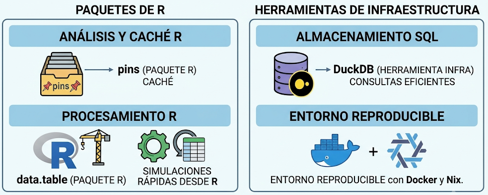
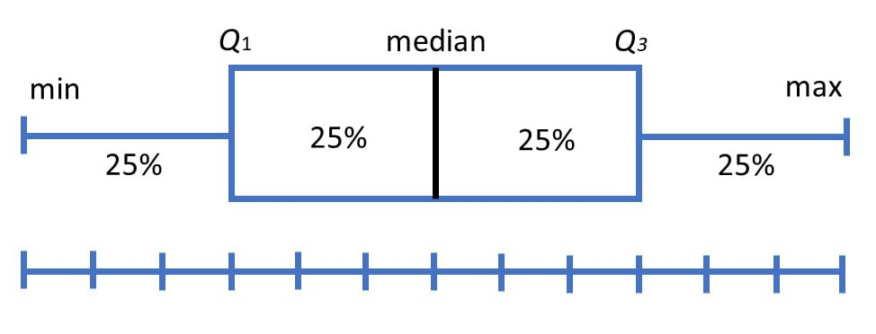
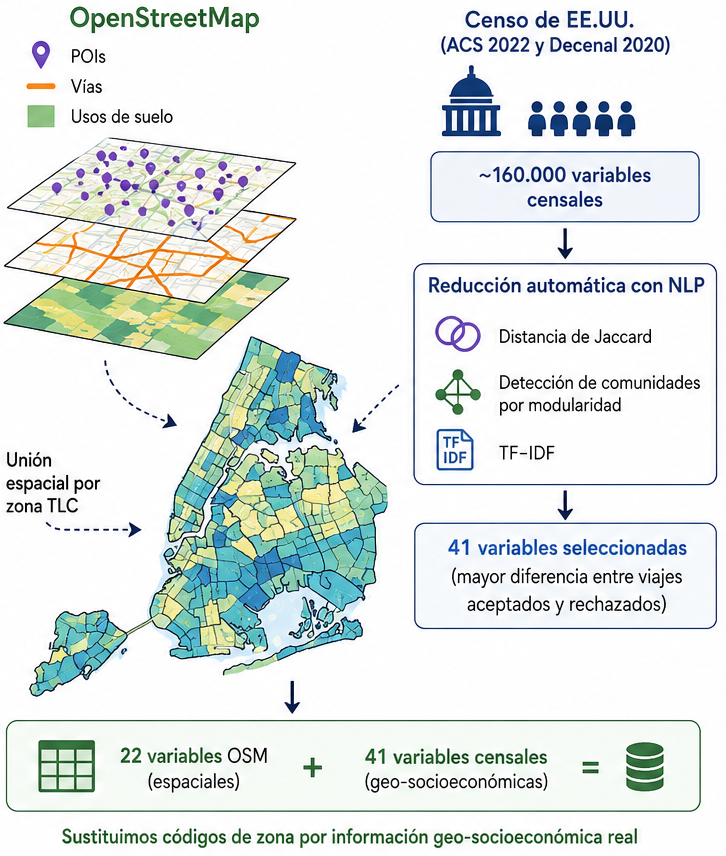
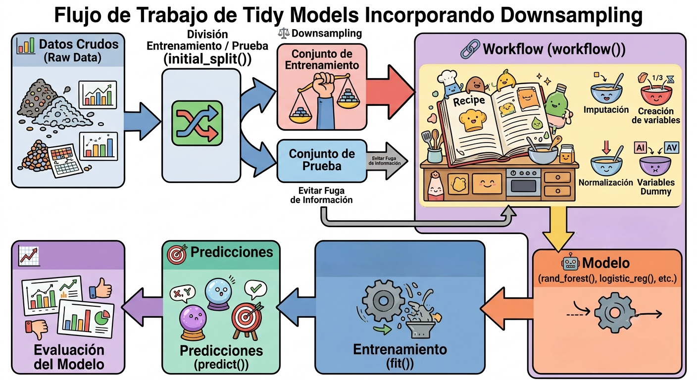
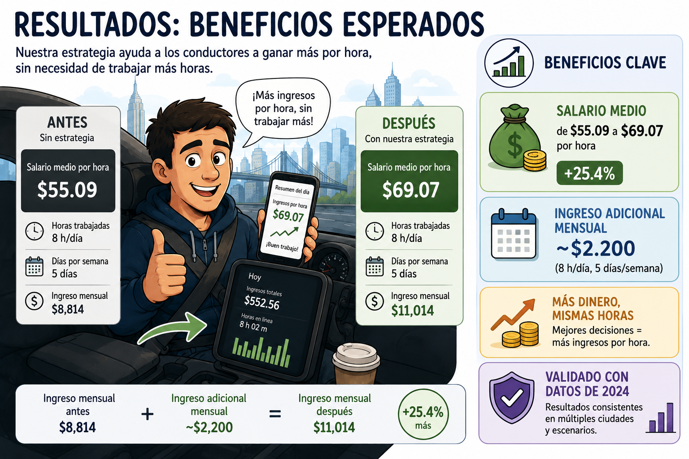

```{r}
#| label: setup
#| include: false

library(here)
library(pins)
library(qs2)
library(data.table)
library(ggplot2)
library(ggtext)
library(scales)
library(lubridate)
library(tidymodels)
library(infer)

BoardLocal <- board_folder(here("../NycTaxiPins/Board"))

Params <- yaml::read_yaml(here("params.yml"))
Params$BoroughColors <- unlist(Params$BoroughColors)

highlight_text <- function(x) {
  paste0(" <span style='color:", Params$ColorHighlight, ";'>**", x, "**</span> ")
}

#| label: load-data
#| include: false
SimulationHourlyWage <- pin_read(BoardLocal, "SimulationHourlyWage")
SimulationStartDay <- pin_read(BoardLocal, "SimulationStartDay")
SimResultsSummary <- pin_read(BoardLocal, "FinalPfaResultsSummary")
SimulationHourlyWage2024 <- pin_read(BoardLocal, "SimulationHourlyWage2024")
FinalStartTimeResults2024 <- pin_read(BoardLocal, "FinalStartTimeResults2024")
FinalPfaResultsSummary2024 <- pin_read(BoardLocal, "FinalPfaResultsSummary2024")
```

## El problema: conductores sin estrategia

{width=90% height=90% fig-align="center"}

---

## Nuestra solución: decisión secuencial + ML

:::: {.columns align=center}

::: {.column width="50%"}
- **Enfoque**: no es una regla fija, es un **sistema de apoyo a la decisión**.

- **Dos niveles**:
  1. ¿Qué viajes aceptar? → modelo predictivo.
  2. ¿Cuándo y con qué plataforma empezar? → estrategia ganadora luego de simular 65k combinaciones

- **Simulación Monte Carlo**: evalúa el impacto real al final del día.
:::

::: {.column width="50%"}

:::

::::

---

## Datos utilizados

:::: {.columns align=center}

::: {.column width="60%" }
- **55 GB** de viajes TLC (2022‑2023) en Parquet.
- Fuentes complementarias: 
    - Censo ACS 2022
    - OpenStreetMap
:::

::: {.column width="40%"}
{width=90% height=70% fig-align="center"}
:::

::::

---

## Recursos para manipulación

:::: {.columns align=center}

::: {.column width="30%" }
- Almacenamiento: **DuckDB** (consultas eficientes) + caché con `pins`.
- Procesamiento: **data.table** para simulaciones rápidas desde **R**.
- Entorno reproducible con **Docker** y **Nix**.
:::

::: {.column width="70%"}
{width=100% height=50% fig-align="center"}
:::

::::

---

## Línea base: ¿cuánto ganan hoy?

```{r}
#| label: fig-baseline-hist-beamer
#| fig.cap: "Distribución del salario medio por hora en la línea base de 1,061 combinaciones con 5 semillas"
#| fig.pos: "!ht"
#| out.width: "78%"
#| echo: false

sim_start_trip_summary <- function(sim_results, sim_start_days) {
  # 1. Type Validation
  if (!data.table::is.data.table(sim_results)) {
    stop("'sim_results' must be a data.table.")
  }
  if (!data.table::is.data.table(sim_start_days)) {
    stop("'sim_start_days' must be a data.table.")
  }

  # 2. Column Validation
  req_results <- c(
    "simulation_id",
    "simulation_seed",
    "sim_dropoff_datetime",
    "sim_driver_pay",
    "sim_tips"
  )
  req_start <- c("trip_id", "request_datetime", "trip_time")

  missing_res <- setdiff(req_results, names(sim_results))
  if (length(missing_res) > 0) {
    stop(
      "sim_results is missing columns: ",
      paste(missing_res, collapse = ", ")
    )
  }

  missing_start <- setdiff(req_start, names(sim_start_days))
  if (length(missing_start) > 0) {
    stop(
      "sim_start_days is missing columns: ",
      paste(missing_start, collapse = ", ")
    )
  }

  # 3. Data Processing
  sim_results <- data.table::copy(sim_results)

  # Join and calculate initial time
  sim_results[
    sim_start_days,
    on = c("simulation_id" = "trip_id"),
    initial_day_time := request_datetime + lubridate::seconds(trip_time)
  ]

  # Validation: Ensure the join didn't result in all NAs
  if (sim_results[, all(is.na(initial_day_time))]) {
    stop(
      "Join failed: simulation_id in 'sim_results' does not match any trip_id in 'sim_start_days'."
    )
  }

  sim_results_summary <- sim_results[,
    .(
      n_trips = .N,
      initial_day_time = mean(initial_day_time),
      sim_dropoff_datetime = mean(sim_dropoff_datetime),
      total_hours_worked = difftime(
        max(sim_dropoff_datetime, na.rm = TRUE),
        min(initial_day_time, na.rm = TRUE),
        units = "hours"
      ) |>
        as.double(),
      total_earnings = sum(sim_driver_pay, na.rm = TRUE) +
        sum(sim_tips, na.rm = TRUE)
    ),
    by = c("simulation_id", "simulation_seed")
  ][, daily_hourly_wage := total_earnings / total_hours_worked][,
    j = c(
      list(
        initial_day_time = initial_day_time,
        final_dropoff_datetime = sim_dropoff_datetime
      ),
      stats::setNames(
        lapply(.SD, base::mean, na.rm = TRUE),
        paste0(names(.SD), "_mean")
      ),
      stats::setNames(
        lapply(.SD, stats::sd, na.rm = TRUE),
        paste0(names(.SD), "_sd")
      )
    ),
    .SDcols = !c("simulation_seed", "initial_day_time", "sim_dropoff_datetime"),
    by = "simulation_id"
  ]

  # 4. Final Formatting
  data.table::setcolorder(
    sim_results_summary,
    c(
      "simulation_id",
      "initial_day_time",
      "final_dropoff_datetime",
      paste0("n_trips", c("_mean", "_sd")),
      paste0("total_hours_worked", c("_mean", "_sd")),
      paste0("total_earnings", c("_mean", "_sd")),
      paste0("daily_hourly_wage", c("_mean", "_sd"))
    )
  )

  return(sim_results_summary)
}

SimulationHourlyWageSummary <-
  sim_start_trip_summary(SimulationHourlyWage, SimulationStartDay)

overall_mean <- mean(SimulationHourlyWageSummary$daily_hourly_wage_mean)
se_mean <- sd(SimulationHourlyWageSummary$daily_hourly_wage_mean) /
  sqrt(nrow(SimulationHourlyWageSummary))

ci_lower <- overall_mean - qnorm(0.975) * se_mean
ci_upper <- overall_mean + qnorm(0.975) * se_mean

SimulationInterval <- data.table(lower_ci = ci_lower, upper_ci = ci_upper)

SimulationVisData <- SimulationHourlyWageSummary[, .(
  replicate = simulation_id,
  stat = daily_hourly_wage_mean
)] |>
  as.data.frame()

attr(SimulationVisData, "class") <- c("infer", "data.frame")
attr(SimulationVisData, "type") <- "bootstrap"

visualize(SimulationVisData) +
  shade_ci(
    endpoints = c(
      lower_ci = SimulationInterval$lower_ci,
      upper_ci = SimulationInterval$upper_ci
    ),
    color = Params$ColorHighlight,
    fill = Params$ColorHighlightLow
  ) +
  geom_vline(xintercept = 66.11, linetype = 2) +
  scale_x_continuous(labels = scales::label_dollar(accuracy = 1),
                     breaks = scales::breaks_width(5)) +
  annotate(
    geom = "text",
    y = 200,
    x = c(
      SimulationInterval[1L][[1L]] - 1.8,
      SimulationInterval[1L][[2L]] + 1.8
    ),
    label = unlist(SimulationInterval) |> comma(accuracy = 0.01),
    color = "white",
    fontface = "bold"
  ) +
  labs(title = "Distribución Del Salario Medio Por Hora", 
       subtitle = "Luego de completar al menos **8 horas** de trabajo",
       x = "Salario Medio Por Hora ($)",
       y = "Count") +
  theme_light(base_family = Params$BaseFontFamily) +
  theme(
    panel.grid.minor.y = element_blank(),
    panel.grid.major.y = element_blank(),
    plot.title = element_text(face = "bold"),
    plot.subtitle = element_markdown(),
    plot.title.position = "plot",
    axis.title = element_text(face = "bold")
  )
```

---

## Definición de target: Etiquetado con "Lookahead" (ADP)

:::: {.columns align=center}

::: {.column width="40%"}
- Para cada viaje en $t$, miramos las alternativas en los **próximos 15 min** (misma compañía, WAV, radio expandible).
- Etiqueta = 1 si el viaje supera el **percentil 75** de las alternativas.
- Así generamos la variable objetivo para el clasificador.
:::

::: {.column width="60%"}
- **Rendimiento**: 
$$
\text{perf} = \frac{\text{driver\_pay} + \text{tips}}{(\text{trip\_time} + \text{waiting\_secs}) / 3600} 
$$



:::

::::

---

## Feature Engineering: Variables Espaciales

:::: {.columns align=center}

::: {.column width="60%"}
- **Problema**: `PULocationID` y `DOLocationID` tienen ~200 zonas → alta cardinalidad.
- **OpenStreetMap**: densidad de POIs, longitud de vías, usos de suelo.
  - Cálculo por zona TLC mediante unión espacial.
  - Tras selección, conservamos **22 variables**.
- **Censo de EE.UU. (ACS 2022 y Decenal 2020)**:
  - Partimos de ~160.000 variables censales.
  - Reducción automática con NLP: distancia de Jaccard + detección de comunidades por modularidad + TF‑IDF.
  - Finalmente seleccionamos las **41 variables** con mayor diferencia entre viajes aceptados y rechazados.
:::

::: {.column width="40%"}

:::

::::


---

## Feature Engineering: Variables Temporales y Limpieza

:::: {.columns align=center}

::: {.column width="40%"}
- **Ciclicidad temporal**:
  - Transformaciones seno y coseno (`step_harmonic`) para hora del día y día de la semana.
  - Permite al modelo entender que las 23:00 es similar a la 01:00.
- **Festivos**: variables indicadoras y "días hasta" próximos festivos (`step_holiday`).
- **Limpieza de outliers**:
  - Eliminados viajes con:
    - `trip_time < 2 min`
    - `trip_miles <= 0`
    - `driver_pay <= 0`
:::

::: {.column width="60%"}

:::

::::

---

## Feature Engineering: Balanceo de Clases y Workflow

{width=90% fig-align="center"}

---

## Selección de Modelo

```{r}
#| label: fig-model-comparison-beamer
#| fig.cap: "Comparación del Brier Score. Optimización bayesiana: 0.150 → 0.144 en Xgboost."
#| fig.pos: "!ht"
#| out.width: "92%"
#| echo: false

XgboostOptimized <-
  pin_read(BoardLocal, name = "MetricsXgboostHistory") |>
  filter(.metric == "brier_class") |>
  mutate(model = "reduced_levels_xgboost_optimized",
         median_of_mean_score = min(mean, na.rm = TRUE))

pin_read(
  BoardLocal,
  "WorkFlowTunedBest"
) |>
  group_by(model) |>
  mutate(median_of_mean_score = quantile(mean, probs = 0.75)) |>
  ungroup() |>
  bind_rows(XgboostOptimized) |>
  mutate(
    model = reorder(model, -mean, FUN = median),
    best_models = case_when(
      median_of_mean_score < 0.18 ~ "group1",
      median_of_mean_score < 0.23 ~ "group2",
      .default = "other"
    )
  ) |>
  ggplot(aes(model, mean)) +
  geom_boxplot(aes(fill = best_models)) +
  scale_fill_manual(
    values = c(
      "group1" = Params$ColorHighlight,
      "group2" = Params$ColorHighlightLow,
      "other" = Params$ColorGray
    )
  ) +
  coord_flip() +
  labs(
    title = paste0(
      highlight_text("Xgboost"),
      "**demostró ser el modelo más efectivo**"
    ),
    subtitle = "Luego de usar **Optimización Bayesiana** para definir hiperparámetros",
    y = "Brier Score",
    x = "Modelos Entrenados"
  ) +
  theme_light(base_family = Params$BaseFontFamily) +
  theme(
    plot.title.position = "plot",
    plot.title = element_markdown(size = 14),
    plot.subtitle = element_markdown(size = 12),
    panel.grid.major.y = element_blank(),
    panel.grid.minor.y = element_blank(),
    legend.position = "none"
  )
```

---

## XGBoost: Variabes Más Relevantes

```{r}
#| label: fig-feature-importance
#| fig-cap: "Contribución de los grupos de variables al poder predictivo (Gain) y cobertura (Cover)"
#| fig.pos: "!ht"
#| out.width: "92%"
#| echo: false

XgboostFeatureImportance <- 
  pin_read(BoardLocal, "XgboostWfFitted") |>
  extract_fit_engine() |>
  xgboost::xgb.importance(model = _)

XgboostFeatureImportance[
  j = list(n_vars = .N,
            Cover = sum(Cover, na.rm = TRUE),
            Gain = sum(Gain, na.rm = TRUE)),
  by = list(Feature = fcase(
      Feature %chin% c("trip_time", "driver_pay", "trip_miles"), Feature,
      Feature %like% "^request_datetime", "request_datetime",
      Feature %like% "^PU_\\w\\d+", "PU_census",
      Feature %like% "^PU_(Borough|service)", "PU_zone_type",
      Feature %like% "^PU_[A-Z]{2}", "PU_OSM",
      Feature %like% "^DO_\\w\\d+", "DO_census",
      Feature %like% "^DO_(Borough|service)", "DO_zone_type",
      Feature %like% "^DO_[A-Z]{2}", "DO_OSM",
      Feature %like% "^company", "company",
      Feature %like% "^wav_match_flag", "wav_match_flag",
      Feature %like% "^Days to", "days_to_US_holydays"
    ))
][n_vars > 1L, 
  Feature := paste0(Feature, " (", scales::comma(n_vars) ,")")] |>
  ggplot(aes(Cover, Gain)) +
  geom_blank(aes(Cover * 1.18)) +
  geom_hline(yintercept = 0.1, linetype = 2, color = "black") +
  geom_hline(yintercept = 0.05, linetype = 2, color = "black") +
  geom_smooth(method = "lm", 
              se = FALSE,
              color = Params$ColorHighlight) +
  geom_label(aes(label = Feature), size = 2.5) +
  scale_x_continuous(labels = label_percent(accuracy = 1),
                     breaks = breaks_width(0.05)) +
  scale_y_continuous(labels = label_percent(accuracy = 1),
                     breaks = breaks_width(0.05)) +
  expand_limits(x = -0.03) +
  labs(
    title = paste0("**Las** ", 
                   highlight_text("4 variables"),
                   "**más relevantes presentan una contribución mayor al 10%**"),
    subtitle = "*Luego de sumar el efecto individual de las variables derivadas*",
    x = "Cover (%) - % de observaciones afectadas",
    y = "Gain (%) - Contribución al poder predictivo"
  ) +
  theme_minimal(base_family = Params$BaseFontFamily) +
  theme(
    panel.grid.minor.y = element_blank(),
    panel.grid.minor.x = element_blank(),
    plot.title = element_markdown(size = 9.5),
    plot.subtitle = element_markdown(size = 9),
    plot.title.position = "plot",
    axis.text.x.top = element_text(angle = 90, hjust = 0),
    axis.title = element_text(face = "bold", size = 7)
  )
```

---

## Optimización del umbral de aceptación

```{r}
#| label: fig-threshold-opt-beamer
#| fig.cap: "Rendimiento del salario medio en función del umbral"
#| fig.pos: "!ht"
#| out.width: "90%"
#| echo: false

SimResultsSummary <- pin_list(BoardLocal) |> grep(pattern = "SimResultsSummary_", value = TRUE) |>
  lapply(FUN = \(x) { pin_read(BoardLocal, x)[, tau_used := sub("SimResultsSummary_", "", x) |> as.double()] }) |>
  rbindlist(use.names = TRUE)

HourlyWageByTau <- SimResultsSummary[,
  .(mean_n_trips = mean(n_trips_mean), se_n_trips = sd(n_trips_mean) / sqrt(.N),
    mean_wage = mean(daily_hourly_wage_mean), se_wage = sd(daily_hourly_wage_mean) / sqrt(.N)),
  by = "tau_used"]
BestResult <- HourlyWageByTau[which.max(mean_wage), ]

ggplot(HourlyWageByTau, aes(tau_used, mean_wage)) +
  geom_vline(xintercept = BestResult$tau_used, linetype = 2) +
  geom_line(color = Params$ColorHighlight, linewidth = 1) +
  geom_point(size = 2) +
  geom_errorbar(aes(ymin = mean_wage - 1.96 * se_wage, ymax = mean_wage + 1.96 * se_wage), width = 0.015, alpha = 0.6) +
  scale_x_continuous(breaks = breaks_width(0.1)) +
  scale_y_continuous(breaks = breaks_width(1), label = dollar_format(1)) +
  labs(title = "Seleccionar threshold 0.9 da los mejores retornos",
       subtitle = "Luego de ese valor los beneficios se reducen", x = "Threshold", y = "Ganancia por hora") +
  theme_minimal(base_family = Params$BaseFontFamily) +
  theme(legend.position = "none", plot.title = element_text(face = "bold", size = 14),
        plot.title.position = "plot", axis.title = element_text(face = "bold"), panel.grid.minor = element_blank())
```

---

## Simulación de Mejor Momento para Empezar

```{r}
#| label: fig-start-dist
#| fig-cap: "Distribución del salario medio por hora para las 65.856 combinaciones de inicio."
#| fig.pos: "!ht"
#| out.width: "95%"
#| echo: false

InitialZoneSimResults <- pin_read(
  BoardLocal,
  "InitialZoneSimResults"
)

FinalPfaMeans <- pin_read(
  BoardLocal,
  "FinalPfaMeans"
)

TopDailyHourlyWage <- quantile(
  InitialZoneSimResults$daily_hourly_wage_mean,
  0.90
)

InitialZoneSimResults[,
  is_top_trip := fifelse(
    daily_hourly_wage_mean >= TopDailyHourlyWage,
    "yes",
    "no"
  ) |>
    factor(levels = c("no", "yes"))
]

BreaksToPlot <- c(seq(20, 200, 10), unname(FinalPfaMeans)) |> setdiff(60L)

ggplot(
  InitialZoneSimResults,
  aes(daily_hourly_wage_mean, fill = is_top_trip)
) +
  geom_histogram(color = "black", bins = 30) +
  geom_vline(
    xintercept = FinalPfaMeans[2L],
    linetype = 2
  ) +
  scale_y_continuous(
    label = label_comma(accuracy = 1)
  ) +
  scale_x_continuous(
    label = label_currency(accuracy = 1),
    breaks = setdiff(BreaksToPlot, FinalPfaMeans[1L])
  ) +
  scale_fill_manual(
    values = c("yes" = Params$ColorHighlight, "no" = Params$ColorGray)
  ) +
  labs(
    title = paste0(
      "**Top**",
      highlight_text("10%"),
      "**de las combinaciones simuladas pudo**<br>**generar por lo menos**",
      highlight_text(paste0("_", dollar(TopDailyHourlyWage), " por hora_"))
    ),
    y = "Count",
    x = "Daily Hourly Wage"
  ) +
  theme_minimal(base_size = 10,
                base_family = Params$BaseFontFamily) +
  theme(
    plot.title = element_markdown(size = 12),
    axis.title = element_text(face = "bold"),
    plot.title.position = "plot",
    panel.grid.minor.x = element_blank(),
    panel.grid.minor.y = element_blank(),
    legend.position = "none"
  )
```

---

## Resultados del Árbol de Decisión

```{r}
#| label: fig-start-tree-beamer
#| fig.cap: "Horarios para viajes de Uber en cualquier zona."
#| fig.pos: "!ht"
#| out.width: "95%"
#| echo: false

Weekdays <- c(
  "Domingo",
  "Lunes",
  "Martes",
  "Miércoles",
  "Jueves",
  "Viernes",
  "Sábado"
)

pin_read(BoardLocal, "TreeResultsToExplain") |>
  filter(taxi_company_Uber == 1L) |>
  distinct(
    .pred_class,
    day_cycle_sin_1,
    day_cycle_cos_1,
    time_hour = hour(request_datetime),
    week_day = factor(
      Weekdays[wday(request_datetime)],
      levels = c(Weekdays[-1L], Weekdays[1L])
    ),
    week_cycle_sin_1,
    week_cycle_cos_1
  ) |>
  ggplot(aes(
    day_cycle_sin_1,
    day_cycle_cos_1,
    color = .pred_class
  )) +
  geom_text(aes(label = time_hour), fontface = "bold", size = 3.5) +
  scale_color_manual(
    values = c("yes" = Params$ColorHighlight, "no" = Params$ColorGray)
  ) +
  facet_wrap(vars(week_day), ncol = 4) +
  coord_fixed() +
  labs(
    title = paste0(
      "**La mayoría de días el taxista puede trabajar a partir de las**",
      highlight_text("21 horas")
    ),
    subtitle = "_Los **lunes** y **viernes** el taxista puede descansar_"
  ) +
  theme_minimal(base_family = Params$BaseFontFamily, base_size = 9) +
  theme(
    legend.position = "none",
    panel.grid = element_blank(),
    strip.background = element_rect(color = "black"),
    strip.text = element_text(face = "bold", size = 9),
    axis.text = element_blank(),
    axis.title = element_blank(),
    plot.title = element_markdown(),
    plot.subtitle = element_markdown(),
    plot.title.position = "plot"
  )
```

---

## Política completa: aceptación selectiva + inicio óptimo

```{r}
#| label: fig-final-policy-beamer
#| fig.cap: "Comparación de estrategias de promediar $69.07 (25.4%)"
#| fig.pos: "!ht"
#| out.width: "76%"
#| echo: false

FinalPfaMeansAfterStart <- pin_read(
  BoardLocal,
  "FinalPfaMeansAfterStart"
)

FinalPfaResultsSummary <- pin_read(
  BoardLocal,
  "FinalPfaResultsSummary"
)

PolicyLevels <- c(
  "Aceptar todos los viajes",
  "Aceptar viajes basado en política",
  "Política + Ajustar inicio"
)

PolicyLevelsFillColors <- c(
  Params$ColorGray,
  Params$ColorGray,
  Params$ColorHighlight
)
setattr(PolicyLevelsFillColors, "names", PolicyLevels)

FinalPfaResultsSummary[, strategy := fcase(
  strategy == "Accept All Trips",
  PolicyLevels[1L],
  strategy == "Accept Based On Policy",
  PolicyLevels[2L],
  strategy == "Setting Start Time",
  PolicyLevels[3L]
) ]

FinalPfaResultsSummary[, strategy := factor(strategy, PolicyLevels)]

ggplot(FinalPfaResultsSummary, aes(strategy, daily_hourly_wage_mean)) +
  geom_boxplot(aes(fill = strategy), width = 0.5) +
  geom_hline(yintercept = FinalPfaMeansAfterStart[3L], linetype = 2) +
  scale_fill_manual(
    values = PolicyLevelsFillColors
  ) +
  scale_y_continuous(breaks = breaks_width(10), label = dollar_format(1)) +
  labs(
    title = paste0(
      highlight_text(PolicyLevels[3L]),
      "**es la mejor estrategia**"
    ),
    subtitle = paste0(
      "El nuevo promedio es cercano a **",
      dollar(FinalPfaMeansAfterStart[3L], accuracy = 1),
      "** confirmando resultados estables"
    ),
    x = "Estrategia Implementada",
    y = "Ganancia por hora al final del día"
  ) +
  theme_light(base_family = Params$BaseFontFamily) +
  theme(
    plot.title = element_markdown(size = 14, family = Params$BaseFontFamily),
    plot.subtitle = element_markdown(size = 12, family = Params$BaseFontFamily),
    plot.title.position = "plot",
    axis.title = element_text(face = "bold", size = 9),
    panel.grid.major.x = element_blank(),
    panel.grid.minor.x = element_blank(),
    panel.grid.minor.y = element_blank(),
    legend.position = "none"
  )
```

---

## Validación con datos de 2024 (fuera de muestra)

```{r}
#| label: fig-policy-performance-beamer
#| fig.cap: "Comparación mensual en 2024"
#| fig.pos: "!ht"
#| out.width: "78%"
#| echo: false

PolicyLevels <- c("Accept All Trips", "Setting Start Time")
FinalPfaResultsSummary2024[, strategy := factor(strategy, PolicyLevels)]
FinalPfaMeansAfterStart2024 <- FinalPfaResultsSummary2024[, .(daily_hourly_wage_mean = mean(daily_hourly_wage_mean)), keyby = "strategy"][, setattr(daily_hourly_wage_mean, "names", as.character(strategy))]
PolicyLevelsFillColors <- c(Params$ColorGray, Params$ColorHighlight)
setattr(PolicyLevelsFillColors, "names", PolicyLevels)
TargetMean <- FinalPfaMeansAfterStart2024[2L]

MonthlySummary <- FinalPfaResultsSummary2024[, j = list(N = .N, mean_wage = mean(daily_hourly_wage_mean, na.rm = TRUE)), keyby = list(month = floor_date(initial_day_time, "month"), strategy)]
HighlightedLastPointBase <- MonthlySummary[strategy == PolicyLevels[1L], .SD[.N]]
HighlightedLastPointPolicy <- MonthlySummary[strategy == PolicyLevels[2L], .SD[.N]]

ggplot(MonthlySummary, aes(x = month, y = mean_wage, color = strategy, group = strategy)) +
  geom_line(linewidth = 1.2) + geom_point(size = 3) +
  geom_hline(yintercept = TargetMean, linetype = 2) +
  annotate("text", x = min(MonthlySummary$month), y = TargetMean + 1.4,
           label = paste0("2024 Promedio: ", dollar(TargetMean)), hjust = 0, size = 3.6) +
  geom_label(data = HighlightedLastPointBase, aes(label = dollar(mean_wage)), color = "grey30", fill = "white", fontface = "bold", show.legend = FALSE, nudge_x = 7) +
  geom_label(data = HighlightedLastPointPolicy, aes(label = dollar(mean_wage)), color = Params$ColorHighlight, fill = "white", fontface = "bold", show.legend = FALSE, nudge_x = 7) +
  scale_color_manual(values = PolicyLevelsFillColors) +
  scale_x_date(date_breaks = "1 month", date_labels = "%b", expand = expansion(mult = c(0.03, 0.09))) +
  scale_y_continuous(breaks = breaks_width(5), labels = dollar_format(accuracy = 1)) +
  labs(
    title = paste0(
      "**La <span style='color:",
      Params$ColorHighlight,
      ";'>nueva política de aceptación</span> demuestra mejores resultados**"
    ),
    subtitle = paste0(
      "La ganancia se mantiene en **$69 por hora** mientras que supera ampliamente la estrategia inicial"
    ),
    x = "Mes",
    y = "Ganancia por hora al final del día"
  ) +
  coord_cartesian(clip = "off") +
  theme_light(base_family = Params$BaseFontFamily) +
  theme(plot.title = element_markdown(size = 12), plot.subtitle = element_markdown(size = 10),
        plot.title.position = "plot", axis.title = element_text(face = "bold", size = 9),
        axis.text = element_text(size = 8), plot.margin = margin(t = 5.5, r = 20, b = 5.5, l = 5.5),
        panel.grid.major.x = element_blank(), panel.grid.minor = element_blank(), legend.position = "none")
```

---

## Acciones recomendadas para el conductor

{width=90% fig-align="center"}

---

## Beneficios esperados

{width=90% height=90% fig-align="center"}
