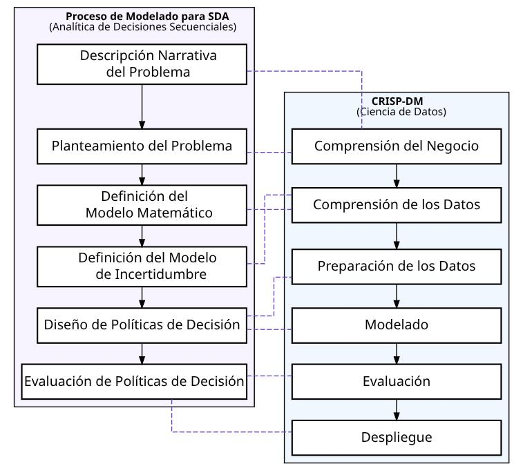

---
execute:
  echo: false
  warning: false
  message: false
format:
  pdf:
    pdf-engine: xelatex
    mainfont: "DejaVu Sans"
    linestretch: 1.5
    documentclass: article
    papersize: letter
    fontsize: 12pt
    toc: true
    toc-depth: 2
    number-sections: true
    colorlinks: true
    fig-width: 7
    fig-dpi: 350
    geometry:
      - margin=0.6in
    include-in-header:
      text: |
        \usepackage{fancyhdr}
        \usepackage{graphicx}
        \usepackage{caption}
    include-before-body:
      text: |
        \begin{titlepage}
        \centering
        {\includegraphics[width=0.4\textwidth]{logo-sbs.jpg}\par}
        \vspace{1cm}
        {\large\bfseries Optimización de Ingresos para Taxistas de Mediante el Análisis de Datos de Vehículos de Alquiler de Alta Demanda \par}
        \vspace{1cm}
        {\large Caso de estudio: NYC High-Volume For-Hire Vehicles\newline(Uber, Lyft, Juno, Via)\par}
        \vspace{1cm}
        {\large Sustentante \par}
        {\large\bfseries Ángel Esteban Féliz Ferreras \par}
        \vspace{1cm}
        {\large Maestría \par}
        {\large\bfseries Ciencia de Datos \par}
        \vspace{1cm}
        {\large Profesor \par}
        {\large\bfseries Jaime Muñoz Sarciada \par}
        \vspace{1cm}
        {\large Asignatura \par}
        {\large\bfseries Trabajo Fin De Máster \par}
        \vfill
        {\large Santo Domingo, República Dominicana\par}
        {\large \today \par}
        \end{titlepage}
        \newpage
bibliography: references.bib
csl: apa.csl
lang: es
citeproc: true
---

```{r}
#| label: setup to render

## Load required libraries for the document
library(here)
library(pins)
library(qs2)
library(data.table)
library(ggplot2)
library(ggtext)
library(scales)
library(lubridate)
library(tidymodels)
library(infer)

## Set up pin board
BoardLocal <- board_folder(here("../NycTaxiPins/Board"))

## Load project parameters
Params <- yaml::read_yaml(here("params.yml"))
Params$BoroughColors <- unlist(Params$BoroughColors)

## Helper function for dynamic text
highlight_text <- function(x) {
  paste0(" <span style='color:", Params$ColorHighlight, ";'>**", x, "**</span> ")
}

```

\newpage

# Resumen Ejecutivo

Los conductores de vehículos de alquiler en Nueva York carecen de una estrategia clara para seleccionar viajes rentables, lo que reduce sus ingresos por hora. Este proyecto propone un sistema de apoyo a la decisión basado en modelos predictivos y simulación Monte Carlo, con el objetivo de incrementar el salario medio por hora al menos un 20% sin aumentar la jornada laboral.

\bigskip

Utilizando datos públicos de la TLC (2022‑2023) y fuentes complementarias (censos, OpenStreetMap), se entrena un clasificador XGBoost que estima la probabilidad de que un viaje ofertado esté entre el 25% más rentable de las alternativas disponibles en los próximos 15 minutos.

\bigskip

La política óptima de aceptación se define con un umbral de decisión del 90% (τ=0.9) y se combina con la elección de la plataforma (Uber) y el horario de inicio (nocturno), lo que eleva el salario medio de $55.09 a $69.07 por hora (+25.4%), superando el objetivo.

\bigskip

La validación con datos de 2024 confirma la consistencia de los resultados. El proyecto se presenta como una demostración metodológica, con limitaciones éticas y operativas que deben considerarse antes de su implementación masiva.

\newpage

# Introducción al Problema de Negocio

## Contexto

Los conductores de vehículos de alquiler en la ciudad de Nueva York (NYC) enfrentan un desafío constante: trabajar largas jornadas sin una estrategia clara sobre qué viajes aceptar. En un mercado dominado por plataformas como Uber, Lyft, Juno y Via, la mayoría de los conductores adoptan una política pasiva, aceptando prácticamente todos los viajes que se les presentan, sin evaluar su rentabilidad potencial. Esta falta de selectividad conduce a horas de trabajo improductivas y a un ingreso por hora que no refleja el esfuerzo ni el tiempo invertido.

\bigskip

## Objetivo de Negocio

El objetivo central de este proyecto es **incrementar el ingreso promedio por hora de los conductores de taxi en al menos un 20% sin aumentar el número de horas trabajadas**. Se busca dotar a los conductores de un sistema de apoyo a la decisión que les permita:

1. Identificar y aceptar los viajes más rentables
2. Seleccionar las condiciones óptimas para iniciar su jornada laboral (plataforma, zona, día y hora de inicio).

## Alcance

El estudio se centra en los datos de viajes de **Vehículos de Alquiler de Alto Volumen (HVFHS)** que operan en los distritos de **Manhattan, Brooklyn y Queens** durante los años 2022 y 2023. Estos datos, proporcionados por la Comisión de Taxis y Limusinas de Nueva York (TLC), cubren las operaciones de las principales plataformas de ridesharing.

\newpage


## Justificación de un Enfoque Predictivo y Secuencial

Un enfoque basado en **reglas heurísticas fijas** (por ejemplo, "rechazar viajes de menos de 5 dólares") es insuficiente para capturar la complejidad y variabilidad del mercado de viajes, ya que la rentabilidad de un viaje depende de múltiples factores interrelacionados: 

- La hora del día.
- La ubicación inicial del viaje.
- La plataforma utilizada
- La duración del viaje
- La distancia del viaje

Además, la decisión de aceptar o rechazar un viaje no es estática; es un **proceso secuencial** en el que cada decisión afecta las oportunidades futuras y por tanto la única manera que tenemos de saber el efecto acumulado al final del día de tomar diferentes decisiones es **crear una simulación** que emule los efectos de tomar cada decisión bajo cada condición inicial.

Por estas razones, este proyecto adopta un marco combinado de **Analítica de Decisión Secuencial** (propuesto por Warren B. Powell, 2022) y el estándar **CRISP-DM** para el desarrollo de modelos de ciencia de datos. Este enfoque permite:

- **Modelar el proceso de decisión secuencial** a lo largo de una jornada laboral simulada.
- **Aproximar la política óptima de aceptación** mediante un modelo de clasificación supervisado, entrenado con etiquetas generadas a partir de una heurística de "visión hacia adelante" (*lookahead*).
- **Optimizar y validar las políticas** mediante simulación Monte Carlo, generando estimaciones robustas del impacto en los ingresos.

\newpage

# Fuente de los Datos

## Datos de Viajes TLC

La fuente principal de datos son los registros de viajes de la Comisión de Taxis y Limusinas de Nueva York (TLC) para vehículos de alquiler de alto volumen (HVFHS). Estos datos son públicos y se actualizan mensualmente [@nyc_tlc_hvfhs].

Para este proyecto, se utilizaron los datos de los años **2022 y 2023**, que comprenden aproximadamente **55 GB** en formato Parquet. El conjunto de datos incluye información detallada de cada viaje, como:

- **Identificador de la licencia de la base** (`hvfhs_license_num`): Indica la plataforma (HV0002: Juno, HV0003: Uber, HV0004: Via, HV0005: Lyft).
- **Fechas y tiempos**: `request_datetime`, `on_scene_datetime`, `pickup_datetime`, `dropoff_datetime`.
- **Ubicaciones**: `PULocationID` y `DOLocationID` (códigos de zonas TLC de origen y destino).
- **Características del viaje**: `trip_miles` (millas), `trip_time` (segundos), `tolls` (peajes), `airport_fee`.
- **Información económica**: `driver_pay` (pago al conductor sin comisiones), `tips` (propinas).

Adicionalmente, se utilizaron datos complementarios:

- **Tabla de Zonas TLC** (`taxi_zone_lookup.csv`): Mapea los `LocationID` a los nombres de zona y distrito.
- **Shapefile de Zonas TLC** (`taxi_zones.zip`): Para análisis geoespacial de las zonas.
- **Datos del Censo de EE. UU.**: Variables demográficas y socioeconómicas a nivel de sector censal para los distritos de interés. Se utilizaron tablas de la Encuesta sobre la Comunidad Estadounidense (ACS) 2022 y el Censo Decenal 2020 [@tidycensus2026].
- **Datos de OpenStreetMap**: Enriquecemos los datos con características geoespaciales derivadas de OpenStreetMap (OSM) para proporcionar una visión más profunda de cada zona [@osmdata2017].

## Gestión de Datos y Estrategia de Almacenamiento

Para manejar eficientemente el gran volumen de datos, se implementó una estrategia de almacenamiento y consulta en varias capas:

1.  **Descarga Automatizada**: Se desarrolló un proceso de web scraping para descargar automáticamente los archivos Parquet de los años correspondientes desde el sitio web de la TLC.
2.  **Almacenamiento en Particiones**: Los archivos Parquet se organizaron en una estructura de carpetas particionada por `year=` y `month=` para optimizar las consultas.
3.  **Base de Datos DuckDB**: Los archivos Parquet se consolidaron en una base de datos **DuckDB** (archivo `my-db.duckdb`), que permite realizar consultas SQL de alto rendimiento sobre datos que no caben en la memoria RAM. A la tabla principal (`NycTrips`) se le añadió una columna calculada, `performance_per_hour`, que representa el ingreso por hora del viaje (`(driver_pay + tips) / (trip_time / 3600)`) [@r_duckdb].
4.  **Caché con `pins`**: Los resultados intermedios y las muestras de datos procesados se guardaron utilizando el paquete `pins` en formato `qs2`, lo que aceleró el desarrollo y garantizó la reproducibilidad [@r_pins; @qs2].

El tamaño final de la base de datos DuckDB fue de aproximadamente **55.8 GB**. Todo el entorno de trabajo es reproducible mediante `Dockerfile`, `docker-compose.yml` y el archivo `default.nix` (Nix), que definen las versiones exactas de R y las librerías necesarias.

\newpage

# Metodología: Diseño de la Solución

## Marco de Trabajo Integrado: CRISP-DM y SDA

El proyecto se guió por un marco metodológico híbrido que combina el estándar de **minería de datos CRISP-DM** con los principios de la **Analítica de Decisión Secuencial** [@powell2022sequential; @chapman2000crisp]. Este enfoque permitió estructurar el desarrollo de un modelo predictivo y su integración en un proceso de toma de decisiones optimizado.

El siguiente diagrama mapea como se relacionan las fases de ambas metodologías:

{#fig-diagram-method fig-env="figure*"}

```{r}
#| label: fig-diagram-method-source
#| eval: false
#| out.width: "100%"
#| fig-cap: "Marco combinado de Analítica de Decisión Secuencial y CRISP-DM"
#| fig-num: true

DiagrammeR::grViz(
  "
digraph Parallel_Methodologies {
  graph [layout = dot, rankdir = TB, fontsize = 11, splines = ortho, nodesep = 0.65, ranksep = 0.3]
  node [shape = box, fontname = 'sans', penwidth = 1.5, style = filled, fillcolor = '#ffffff', width = 3]
  edge [arrowsize = 0.75]

// ==================== SDA (Powell) ====================
subgraph cluster_powell {
  label = <<B>Proceso de Modelado para SDA</B><BR/>(Analítica de Decisiones Secuenciales)>
  fontname = 'sans'
  labeljust = 'c'
  style = filled; fillcolor = '#F8F4FF'
  
  ProblemNarrative [label = <Descripción Narrativa<BR/>del Problema>]
  ProblemFraming [label = 'Planteamiento del Problema']
  MathModel [label = <Definición del<BR/>Modelo Matemático>]
  UncertaintyModel [label = <Definición del Modelo<BR/>de Incertidumbre>]
  DesignPolicies [label = 'Diseño de Políticas de Decisión']
  EvaluatePolicies [label = <Evaluación de<BR/>Políticas de Decisión>]
}

// ==================== CRISP-DM ====================
subgraph cluster_crisp {
  label = <<B>CRISP-DM</B><BR/>(Ciencia de Datos)>
  fontname = 'sans'
  labeljust = 'c'
  style = filled; fillcolor = '#F0F7FF'

  Business [label = 'Comprensión del Negocio']
  DataU [label = 'Comprensión de los Datos']
  DataP [label = 'Preparación de los Datos']
  Modeling [label = 'Modelado']
  Evaluation [label = 'Evaluación']
  Deployment [label = 'Despliegue']
}

  // Flujo interno Powell
  ProblemNarrative -> ProblemFraming -> MathModel -> UncertaintyModel -> DesignPolicies -> EvaluatePolicies

  // Flujo interno CRISP-DM
  Business -> DataU -> DataP -> Modeling -> Evaluation -> Deployment

  // Conexiones comunes (líneas intermitentes)
  edge [arrowsize = 0, style = dashed, color = '#6B46C0']
  ProblemNarrative -> Business
  ProblemFraming -> Business
  MathModel -> DataU
  UncertaintyModel -> DataU
  DesignPolicies -> Modeling
  DesignPolicies -> DataP
  EvaluatePolicies -> Evaluation
  EvaluatePolicies -> Deployment

  edge [arrowsize = 0, style = invis]
  Business -> ProblemNarrative
  Business -> ProblemFraming
  DataU -> MathModel
  DataU -> UncertaintyModel
  Modeling -> DesignPolicies
  DataP -> DesignPolicies
  Evaluation -> EvaluatePolicies
  Deployment -> EvaluatePolicies
}
"
)
```

## Abreviaturas Clave


- **SDA (Sequential Decision Analytics)**: Analítica de Decisiones Secuenciales. Marco conceptual propuesto por Warren B. Powell para modelar y optimizar problemas de decisión que se desarrollan en el tiempo bajo incertidumbre, combinando modelos matemáticos, simulación y aprendizaje automático.
- **ADP (Approximate Dynamic Programming)**: Programación Dinámica Aproximada. Técnica dentro del marco SDA para resolver problemas de decisión secuencial en entornos estocásticos cuando la programación dinámica exacta es intratable.
- **CRISP-DM (Cross-Industry Standard Process for Data Mining)**: Estándar de proceso para la minería de datos.
- **HVFHS (High-Volume For-Hire Services)**: Servicios de Vehículos de Alquiler de Alto Volumen (Uber, Lyft, Juno, Via).
- **XGBoost (eXtreme Gradient Boosting)**: Algoritmo de *gradient boosting* utilizado para el modelo de clasificación.
- **PFA (Policy Function Approximation)**: Aproximación de la Función de Política, el modelo de ML que aproxima la decisión óptima.
- **WAV (Wheelchair Accessible Vehicle)**: Vehículo Accesible para Silla de Ruedas.

\newpage

# Desarrollo y Resultados Técnicos

## Definición línea base

Definir la línea base a partir de los datos disponibles es complicado porque estos carecen de un **identificador único** para realizar una estimación directa. Sin embargo, podemos **realizar una simulación** para estimar el valor de la línea base junto con un intervalo de confianza.

\bigskip

La simulación se basa en los siguientes **supuestos** acerca de los conductores de taxi:

1.  Pueden comenzar a trabajar:
    -   Desde cualquier zona de Manhattan, Brooklyn o Queens (los distritos más activos).
    -   En cualquier mes, cualquier día de la semana y cualquier hora.

2.  El número de licencia de la TLC (compañía de taxi) debe permanecer constante para todos los viajes dentro de una misma jornada laboral.

3.  Solo los vehículos accesibles para sillas de ruedas pueden aceptar viajes que soliciten un vehículo accesible para sillas de ruedas.

4.  Debido a que no podemos determinar si cada zona tiene más taxis activos que pasajeros, asumimos que siempre hay más pasajeros que taxis. En consecuencia, cada conductor **elige un viaje válido al azar** entre los candidatos encontrados dentro del radio de búsqueda actual y la ventana de tiempo (respetando la compatibilidad con WAV, la misma compañía de taxi y el límite de tiempo diario).

5.  Los taxis buscan viajes en función del tiempo de espera y aceptan el primer viaje encontrado dentro de un radio que se expande:
    -   0–1 minuto: buscan dentro de un radio de 1 milla.
    -   1–3 minutos: si no encuentran ningún viaje, amplían la búsqueda a un radio de 3 millas.
    -   3–5 minutos: si aún no encuentran ningún viaje, amplían a un radio de 5 millas.
    -   Continúan añadiendo 2 millas cada dos minutos hasta encontrar un viaje.

6.  Los conductores toman un descanso de 30 minutos después de 4 horas de trabajo, pero solo después de completar el viaje en curso.

7.  Aceptarán su último viaje después de trabajar 8 horas (el descanso de 30 minutos no se cuenta dentro de las 8 horas).

Para generar las **condiciones iniciales** (1.061 combinaciones), se realizó un muestreo aleatorio estratificado por mes, día de la semana y hora del día desde la tabla DuckDB, asegurando una representación equilibrada de distritos (Manhattan, Brooklyn, Queens) y compañías (Uber, Lyft, Juno, Via). Cada condición se simuló con 5 semillas reproducibles para obtener estimaciones robustas.

Después de simular estas condiciones, podemos utilizar los resultados de Monte Carlo para inferir la distribución del salario medio diario por hora. Los ingresos promedio por hora se sitúan entre **\$54.97** y **\$55.21**, con un 95% de confianza, y una media de $55.09 dólares por hora (@fig-baseline-hist).

```{r}
#| label: fig-baseline-hist
#| fig-cap: "Distribución del salario medio por hora en la línea base (simulación Monte Carlo)"
#| fig-num: true

SimulationHourlyWage <- pin_read(BoardLocal,"SimulationHourlyWage")
SimulationStartDay <- pin_read(BoardLocal, "SimulationStartDay")

sim_start_trip_summary <- function(sim_results, sim_start_days) {
  # 1. Type Validation
  if (!data.table::is.data.table(sim_results)) {
    stop("'sim_results' must be a data.table.")
  }
  if (!data.table::is.data.table(sim_start_days)) {
    stop("'sim_start_days' must be a data.table.")
  }

  # 2. Column Validation
  req_results <- c(
    "simulation_id",
    "simulation_seed",
    "sim_dropoff_datetime",
    "sim_driver_pay",
    "sim_tips"
  )
  req_start <- c("trip_id", "request_datetime", "trip_time")

  missing_res <- setdiff(req_results, names(sim_results))
  if (length(missing_res) > 0) {
    stop(
      "sim_results is missing columns: ",
      paste(missing_res, collapse = ", ")
    )
  }

  missing_start <- setdiff(req_start, names(sim_start_days))
  if (length(missing_start) > 0) {
    stop(
      "sim_start_days is missing columns: ",
      paste(missing_start, collapse = ", ")
    )
  }

  # 3. Data Processing
  sim_results <- data.table::copy(sim_results)

  # Join and calculate initial time
  sim_results[
    sim_start_days,
    on = c("simulation_id" = "trip_id"),
    initial_day_time := request_datetime + lubridate::seconds(trip_time)
  ]

  # Validation: Ensure the join didn't result in all NAs
  if (sim_results[, all(is.na(initial_day_time))]) {
    stop(
      "Join failed: simulation_id in 'sim_results' does not match any trip_id in 'sim_start_days'."
    )
  }

  sim_results_summary <- sim_results[,
    .(
      n_trips = .N,
      initial_day_time = mean(initial_day_time),
      sim_dropoff_datetime = mean(sim_dropoff_datetime),
      total_hours_worked = difftime(
        max(sim_dropoff_datetime, na.rm = TRUE),
        min(initial_day_time, na.rm = TRUE),
        units = "hours"
      ) |>
        as.double(),
      total_earnings = sum(sim_driver_pay, na.rm = TRUE) +
        sum(sim_tips, na.rm = TRUE)
    ),
    by = c("simulation_id", "simulation_seed")
  ][, daily_hourly_wage := total_earnings / total_hours_worked][,
    j = c(
      list(
        initial_day_time = initial_day_time,
        final_dropoff_datetime = sim_dropoff_datetime
      ),
      stats::setNames(
        lapply(.SD, base::mean, na.rm = TRUE),
        paste0(names(.SD), "_mean")
      ),
      stats::setNames(
        lapply(.SD, stats::sd, na.rm = TRUE),
        paste0(names(.SD), "_sd")
      )
    ),
    .SDcols = !c("simulation_seed", "initial_day_time", "sim_dropoff_datetime"),
    by = "simulation_id"
  ]

  # 4. Final Formatting
  data.table::setcolorder(
    sim_results_summary,
    c(
      "simulation_id",
      "initial_day_time",
      "final_dropoff_datetime",
      paste0("n_trips", c("_mean", "_sd")),
      paste0("total_hours_worked", c("_mean", "_sd")),
      paste0("total_earnings", c("_mean", "_sd")),
      paste0("daily_hourly_wage", c("_mean", "_sd"))
    )
  )

  return(sim_results_summary)
}

SimulationHourlyWageSummary <-
  sim_start_trip_summary(SimulationHourlyWage, SimulationStartDay)

overall_mean <- mean(SimulationHourlyWageSummary$daily_hourly_wage_mean)
se_mean <- sd(SimulationHourlyWageSummary$daily_hourly_wage_mean) /
  sqrt(nrow(SimulationHourlyWageSummary))

ci_lower <- overall_mean - qnorm(0.975) * se_mean
ci_upper <- overall_mean + qnorm(0.975) * se_mean

SimulationInterval <- data.table(lower_ci = ci_lower, upper_ci = ci_upper)

SimulationVisData <- SimulationHourlyWageSummary[, .(
  replicate = simulation_id,
  stat = daily_hourly_wage_mean
)] |>
  as.data.frame()

attr(SimulationVisData, "class") <- c("infer", "data.frame")
attr(SimulationVisData, "type") <- "bootstrap"

visualize(SimulationVisData) +
  shade_ci(
    endpoints = c(
      lower_ci = SimulationInterval$lower_ci,
      upper_ci = SimulationInterval$upper_ci
    ),
    color = Params$ColorHighlight,
    fill = Params$ColorHighlightLow
  ) +
  scale_x_continuous(labels = scales::label_dollar(accuracy = 1),
                     breaks = scales::breaks_width(5)) +
  annotate(
    geom = "text",
    y = 200,
    x = c(
      SimulationInterval[1L][[1L]] - 1.8,
      SimulationInterval[1L][[2L]] + 1.8
    ),
    label = unlist(SimulationInterval) |> comma(accuracy = 0.01),
    color = "white",
    fontface = "bold"
  ) +
  labs(title = "Distribución Del Salario Medio Por Hora", 
       subtitle = "Luego de completar al menos **8 horas** de trabajo",
       x = "Salario Medio Por Hora ($)",
       y = "Count") +
  theme_light(base_family = Params$BaseFontFamily) +
  theme(
    panel.grid.minor.y = element_blank(),
    panel.grid.major.y = element_blank(),
    plot.title = element_text(face = "bold"),
    plot.subtitle = element_markdown(),
    plot.title.position = "plot",
    axis.title = element_text(face = "bold")
  )
```

Esto significa que, para incrementarlo en un 20%, la nueva tarifa debe ser de al menos $66.11 dólares por hora, lo que se traduce en un aumento de $1,762.92 cada mes.

## Preprocesamiento y Feature Engineering

El preprocesamiento de datos fue una fase extensa que combinó transformaciones estándares, ingeniería de variables temporales y espaciales, y la integración de fuentes de datos externas para enriquecer el conjunto de entrenamiento. Todo este proceso se encapsuló en una receta (`recipe`) de `tidymodels` para garantizar su reproducibilidad.

### Variables Espaciales

- **Variables TLC**: Se incorporaron las variables categóricas de origen (`PULocationID`) y destino (`DOLocationID`). Dada su alta cardinalidad (más de 200 zonas), se aplicaron técnicas de codificación y se enriquecieron con sus correspondientes distritos (`borough`) y zona de servicio.
- **Densidad de Puntos de Interés (OSM)**: Se descargaron datos de OpenStreetMap para los distritos de interés utilizando los paquetes `osmdata` y `sf`. Para cada zona TLC, se calcularon métricas de densidad para diferentes categorías de puntos (ej. `amenity`, `shop`), líneas (ej. `highway`) y polígonos (ej. `landuse`). Estas métricas se calcularon por milla cuadrada.
- **Datos Socioeconómicos (Censo de EE. UU.)**: Se utilizó `tidycensus` para descargar variables de la ACS 2022 y el Censo Decenal 2020 a nivel de sector censal. Mediante un proceso de unión espacial (*spatial join*), se agregaron estas variables a las zonas TLC, calculando la media ponderada por área. El análisis de componentes principales y la selección de variables mediante **NLP y clustering** redujeron un espacio de ~160.000 variables a las más relevantes para la movilidad.

### Variables Temporales

- **Ciclos Diarios y Semanales**: En lugar de usar la hora y el día de la semana de forma lineal, se utilizaron transformaciones seno y coseno (`step_harmonic`) para representar la naturaleza cíclica del tiempo. Esto permite que el modelo aprenda patrones como "las 23:00 es similar a la 01:00", algo que los valores numéricos lineales no capturan bien.
- **Festivos**: Se generaron variables indicadoras y de "días hasta" para los principales festivos de EE. UU. (`step_holiday`).
- **Franjas Horarias**: Se crearon variables binarias para AM/PM y se extrajeron componentes como el mes, semana, día del año, etc.

### Otras Transformaciones

- **Manejo de Valores Atípicos**: Se eliminaron los viajes con `trip_time` < 2 minutos, `trip_miles` <= 0 y `driver_pay` <= 0, considerados erróneos o no representativos.
- **Codificación de Categorías**: Las variables categóricas se convirtieron a *factor* y se aplicó `step_other` para agrupar niveles poco frecuentes.
- **Escalado y Normalización**: Para modelos sensibles a la escala, se aplicaron transformaciones Yeo-Johnson y normalización.

## Modelo de Clasificación (XGBoost) para Viajes de Alto Valor

Para predecir si un viaje en oferta pertenece al **25% más rentable** de las alternativas disponibles en los próximos 15 minutos, se entrenó un modelo de clasificación **XGBoost**. El proceso de entrenamiento fue supervisado gracias a un etiquetado basado en *lookahead*.

### Etiquetado con Lookahead

Siguiendo la metodología ADP, se generó la variable objetivo `take_current_trip` para cada viaje histórico. Para un viaje ofertado en el tiempo $t$, se construyó el conjunto de alternativas $\mathcal{C}_t$ que un conductor habría podido encontrar en los siguientes 15 minutos. Para que un viaje futuro sea considerado una alternativa válida, debe cumplir **exactamente** las mismas restricciones de la simulación base:

1. **Misma compañía**: `hvfhs_license_num` igual.
2. **Compatibilidad WAV**: Un conductor en vehículo accesible (`wav_match_flag == "Y"`) puede ver todos los viajes; un conductor estándar solo ve viajes con `wav_request_flag == "N"`.
3. **Ventana temporal**: La hora de solicitud debe estar entre 3 segundos (retraso por rechazo) y 15 minutos después de la solicitud original.
4. **Expansión de radio**: La distancia desde la zona actual sigue la misma función escalonada que en la simulación base (1 milla al minuto 1, 3 millas al minuto 3, etc.).

El rendimiento (`perf`) de cada viaje se calcula como:

$$
\text{perf} = \frac{\text{driver\_pay} + \text{tips}}{(\text{trip\_time} + \text{waiting\_secs}) / 3600}
$$

donde `waiting_secs` es el tiempo de espera desde la decisión hasta la solicitud del viaje futuro, penalizando así el coste de oportunidad de estar sin viaje.

El viaje actual se etiqueta como **aceptable (1)** si su rendimiento supera el percentil 75 de los rendimientos de todas las alternativas en $\mathcal{C}_t$:

$$
\text{take\_current\_trip}_i = 
\begin{cases} 
  1 \text{ ("Y")} & \text{if } \text{perf}_i > Q_{0.75}(\{\text{perf}_j \mid j \in \mathcal{C}_t\}) \\ 
  0 \text{ ("N")} & \text{if } \text{perf}_i \le Q_{0.75}(\{\text{perf}_j \mid j \in \mathcal{C}_t\}) 
\end{cases}
$$

Este proceso de etiquetado, implementado en paralelo con `future`, garantiza que las etiquetas sean coherentes con el modelo de incertidumbre de la simulación base.

### Entrenamiento y Selección del Modelo

Se evaluaron múltiples algoritmos (Regresión Logística, FDA, MARS, Random Forest y XGBoost) en un pipeline de `tidymodels` con validación cruzada de 5 iteraciones. El modelo XGBoost fue el que demostró el mejor rendimiento económico al traducir su precisión estadística en beneficio monetario, principalmente debido a su capacidad para capturar interacciones complejas entre variables (ej. ubicación-hora-compañía).

Se realizó una **optimización Bayesiana** de hiperparámetros para refinar el modelo, logrando una mejora en el *Brier Score* de 0.150 a **0.1443**. El Brier Score fue la métrica principal de calibración, ya que el objetivo final no es la clasificación en sí, sino el beneficio económico derivado de la política; por ello, la **evaluación final se realiza mediante simulación**.

```{r}
#| label: fig-model-comparison
#| fig-cap: "Comparación del Brier Score de los modelos evaluados; XGBoost optimizado es el más efectivo"
#| fig-num: true
#| fig-height: 4

XgboostOptimized <-
  pin_read(BoardLocal, name = "MetricsXgboostHistory") |>
  filter(.metric == "brier_class") |>
  mutate(model = "reduced_levels_xgboost_optimized",
         median_of_mean_score = min(mean, na.rm = TRUE))

pin_read(
  BoardLocal,
  "WorkFlowTunedBest"
) |>
  group_by(model) |>
  mutate(median_of_mean_score = quantile(mean, probs = 0.75)) |>
  ungroup() |>
  bind_rows(XgboostOptimized) |>
  mutate(
    model = reorder(model, -mean, FUN = median),
    best_models = case_when(
      median_of_mean_score < 0.18 ~ "group1",
      median_of_mean_score < 0.23 ~ "group2",
      .default = "other"
    )
  ) |>
  ggplot(aes(model, mean)) +
  geom_boxplot(aes(fill = best_models)) +
  scale_fill_manual(
    values = c(
      "group1" = Params$ColorHighlight,
      "group2" = Params$ColorHighlightLow,
      "other" = Params$ColorGray
    )
  ) +
  coord_flip() +
  labs(
    title = paste0(
      highlight_text("Xgboost"),
      "**demostró ser el modelo más efectivo**"
    ),
    subtitle = "Luego de usar **Optimización Bayesiana** para definir hiperparámetros",
    y = "Brier Score",
    x = "Modelos Entrenados"
  ) +
  theme_light(base_family = Params$BaseFontFamily) +
  theme(
    plot.title.position = "plot",
    plot.title = element_markdown(size = 14),
    plot.subtitle = element_markdown(size = 12),
    panel.grid.major.y = element_blank(),
    panel.grid.minor.y = element_blank(),
    legend.position = "none"
  )
```

### Variables Más Importantes

Al utilizar la métrica de importancia definida por los diferentes árboles de decisión creados en el modelo pudimos confirmar que la ingeniería de factores empleada fue exitosa, ya que el modelo pudo identificar que las variables más importantes a tomar en cuenta antes de tomar una decisión son `trip_time` y `driver_pay`, seguidas por 41 variables resultantes de agregar variables del Buró de Estadísticas (`PU_census`) y las 25 variables que resultaron de llevar `request_datetime` a otras representaciones más útiles para el modelo (@fig-feature-importance).

```{r}
#| label: fig-feature-importance
#| fig-cap: "Contribución de los grupos de variables al poder predictivo (Gain) y cobertura (Cover)"
#| fig-height: 5.5
#| fig-num: true

XgboostFeatureImportance <- 
  pin_read(BoardLocal, "XgboostWfFitted") |>
  extract_fit_engine() |>
  xgboost::xgb.importance(model = _)

XgboostFeatureImportance[
  j = list(n_vars = .N,
            Cover = sum(Cover, na.rm = TRUE),
            Gain = sum(Gain, na.rm = TRUE)),
  by = list(Feature = fcase(
      Feature %chin% c("trip_time", "driver_pay", "trip_miles"), Feature,
      Feature %like% "^request_datetime", "request_datetime",
      Feature %like% "^PU_\\w\\d+", "PU_census",
      Feature %like% "^PU_(Borough|service)", "PU_zone_type",
      Feature %like% "^PU_[A-Z]{2}", "PU_OSM",
      Feature %like% "^DO_\\w\\d+", "DO_census",
      Feature %like% "^DO_(Borough|service)", "DO_zone_type",
      Feature %like% "^DO_[A-Z]{2}", "DO_OSM",
      Feature %like% "^company", "company",
      Feature %like% "^wav_match_flag", "wav_match_flag",
      Feature %like% "^Days to", "days_to_US_holydays"
    ))
][n_vars > 1L, 
  Feature := paste0(Feature, " (", scales::comma(n_vars) ,")")] |>
  ggplot(aes(Cover, Gain)) +
  geom_blank(aes(Cover * 1.18)) +
  geom_hline(yintercept = 0.1, linetype = 2, color = "black") +
  geom_hline(yintercept = 0.05, linetype = 2, color = "black") +
  geom_smooth(method = "lm", 
              se = FALSE,
              color = Params$ColorHighlight) +
  geom_label(aes(label = Feature)) +
  scale_x_continuous(labels = label_percent(accuracy = 1),
                     breaks = breaks_width(0.05)) +
  scale_y_continuous(labels = label_percent(accuracy = 1),
                     breaks = breaks_width(0.05)) +
  expand_limits(x = -0.03) +
  labs(
    title = paste0("**Las** ", 
                   highlight_text("4 variables"),
                   "**más relevantes presentan una contribución mayor 10%**"),
    subtitle = "*Luego de sumar el efecto individual de las variables derivadas*",
    x = "Cover (%) - % de observaciones afectadas",
    y = "Gain (%) - Contribución al poder predictivo"
  ) +
  theme_minimal(base_family = Params$BaseFontFamily) +
  theme(
    panel.grid.minor.y = element_blank(),
    panel.grid.minor.x = element_blank(),
    plot.title = element_markdown(size = 13.5),
    plot.subtitle = element_markdown(size = 13),
    plot.title.position = "plot",
    axis.text.x.top = element_text(angle = 90, hjust = 0),
    axis.title = element_text(face = "bold", size = 13)
  )
```

## Motor de Simulación de la Política de Decisión Secuencial

Para evaluar el impacto real de las políticas, se implementó un **motor de simulación Monte Carlo** que replica la jornada de un conductor. Este motor, desarrollado como una función optimizada (`simulate_trips`), es la pieza central del proyecto.

### Modelo Matemático de la Simulación

**Variables de Estado (`S_t^n`)**: Representan la situación del conductor en un momento dado.
- `Current_Time`: Fecha y hora actual.
- `Current_Zone`: Zona TLC donde se encuentra el conductor.
- `Taken_Break`: Si ya ha tomado su descanso de 30 minutos.
- `Trip_Time_Limit` y `Trip_Dist_Limit`: Ventana de búsqueda (tiempo y distancia).

**Decisión (`x_t`)**: Bajo la política óptima, la decisión se basa en la probabilidad estimada por el modelo XGBoost:
- $x_t = 1$ (Aceptar) si $\hat{p}_t(S_t) \ge \tau$, donde $\tau$ es un umbral de decisión.
- $x_t = 0$ (Rechazar) en caso contrario.

**Información Exógena (`W_{t+1}^n`)**: Después de aceptar un viaje, el siguiente estado se actualiza con los datos reales del viaje (`Trip_End_Time`, `Trip_End_Zone`, `Trip_Earning`).

**Función de Transición (`S^M`)**: Actualiza el estado del conductor. Si se acepta un viaje, se avanza en el tiempo y la ubicación; si se rechaza, se expande el radio de búsqueda y la ventana de tiempo.

**Función Objetivo**: Maximizar el salario medio por hora de la jornada simulada:
$$
F^{\pi^\tau}(S_0^n) = \mathbb{E}\left[ \frac{\sum_{t=1}^{T^n} \text{Earnings}_t \cdot x_t}{\text{Hours Worked}} \;\middle|\; S_0^n \right]
$$

### Optimización del Umbral de Decisión ($\tau$)

Un hallazgo crucial fue que el umbral de decisión $\tau$ que maximiza la precisión estadística (ej. Brier Score) no es el que maximiza el beneficio económico en la simulación dinámica. La razón es que el costo de un falso negativo (rechazar un viaje bueno) es mucho mayor que el de un falso positivo (aceptar un viaje malo), especialmente considerando el tiempo de espera. La optimización económica en la simulación arrojó un umbral óptimo **$\tau^* = 0.9$**, que es mucho más alto que el 0.5 típico (@fig-threshold-opt). Esto significa que **los conductores deben ser extremadamente selectivos, aceptando solo aquellos viajes con un 90% o más de probabilidad de ser de alto valor**.

Este umbral se obtuvo bajo el **supuesto de abundancia** de viajes (más pasajeros que conductores). En un entorno real con mayor competencia, el valor óptimo podría **reducirse**. 

La simulación de la política de aceptación/rechazo (con $\tau^* = 0.9$) en los datos de 2022-2023 arrojó un aumento en el salario medio por hora de **$55.09 (línea base) a $61.25**, un incremento de **$6.16 por hora**.

```{r}
#| label: fig-threshold-opt
#| fig-cap: "Rendimiento del salario medio por hora en función del umbral τ; el máximo se alcanza en τ=0.9"
#| fig-num: true
#| fig-height: 4

SimResultsSummary <-
  pin_list(BoardLocal) |>
  grep(pattern = "SimResultsSummary_", value = TRUE) |>
  lapply(
    FUN = \(x) {
      pin_read(BoardLocal, x)[,
        tau_used := sub("SimResultsSummary_", "", x) |> as.double()
      ]
    }
  ) |>
  rbindlist(use.names = TRUE)

HourlyWageByTau <-
  SimResultsSummary[,
    .(
      mean_n_trips = mean(n_trips_mean),
      se_n_trips = sd(n_trips_mean) / sqrt(.N),
      mean_wage = mean(daily_hourly_wage_mean),
      se_wage = sd(daily_hourly_wage_mean) / sqrt(.N)
    ),
    by = "tau_used"
  ]

BestResult <- HourlyWageByTau[which.max(mean_wage), ]

ggplot(HourlyWageByTau, aes(tau_used, mean_wage)) +
  geom_vline(xintercept = BestResult$tau_used, linetype = 2) +
  geom_line(
    color = Params$ColorHighlight,
    linewidth = 1
  ) +
  geom_point(size = 2) +
  geom_errorbar(
    aes(ymin = mean_wage - 1.96 * se_wage, ymax = mean_wage + 1.96 * se_wage),
    width = 0.015,
    alpha = 0.6
  ) +
  scale_x_continuous(breaks = breaks_width(0.1)) +
  scale_y_continuous(breaks = breaks_width(1), label = dollar_format(1)) +
  labs(
    title = "Seleccionar como threshold 0.9 nos da los mejores retornos",
    subtitle = "Luego de ese valor los beneficios se reducen",
    x = "Threshold",
    y = "Ganancia por hora al final del día"
  ) +
  theme_minimal(base_family = Params$BaseFontFamily) +
  theme(
    legend.position = "none",
    plot.title = element_text(face = "bold", size = 14),
    plot.title.position = "plot",
    axis.title = element_text(face = "bold"),
    panel.grid.minor = element_blank()
  )
```

## Identificación Tiempo Optimo Para Iniciar Jornada

Para poder confirmar si alguno de los factores definidos al inicio de la jornada podían explicar cambios en el valor percibido por los taxistas al final de la jornada, simulamos por **14 días** 65,856 combinaciones de días diferentes, con el fin de validar el efecto que puede tener:

- La compañía con la que trabaja el taxista
- La zona en la que inicia a trabajar
- El día de la semana y la hora del día

Al graficar los resultados de la simulación (@fig-start-dist) podemos ver que la distribución presenta una larga cola a la derecha, lo que quiere decir que algunos días fueron especialmente rentables, registrando días de hasta **$120** la hora, lo cual serían como ganar **$960** por un día de trabajo.

```{r}
#| label: fig-start-dist
#| fig-cap: "Distribución del salario medio por hora para las 65.856 combinaciones de inicio; el 10% superior supera los $75 por hora"
#| fig-num: true
#| fig-height: 4

InitialZoneSimResults <- pin_read(
  BoardLocal,
  "InitialZoneSimResults"
)

FinalPfaMeans <- pin_read(
  BoardLocal,
  "FinalPfaMeans"
)

TopDailyHourlyWage <- quantile(
  InitialZoneSimResults$daily_hourly_wage_mean,
  0.90
)

InitialZoneSimResults[,
  is_top_trip := fifelse(
    daily_hourly_wage_mean >= TopDailyHourlyWage,
    "yes",
    "no"
  ) |>
    factor(levels = c("no", "yes"))
]

BreaksToPlot <- c(seq(20, 200, 10), unname(FinalPfaMeans)) |> setdiff(60L)

ggplot(
  InitialZoneSimResults,
  aes(daily_hourly_wage_mean, fill = is_top_trip)
) +
  geom_histogram(color = "black", bins = 30) +
  geom_vline(
    xintercept = FinalPfaMeans[2L],
    linetype = 2
  ) +
  scale_y_continuous(
    label = label_comma(accuracy = 1)
  ) +
  scale_x_continuous(
    label = label_currency(accuracy = 1),
    breaks = setdiff(BreaksToPlot, FinalPfaMeans[1L])
  ) +
  scale_fill_manual(
    values = c("yes" = Params$ColorHighlight, "no" = Params$ColorGray)
  ) +
  labs(
    title = paste0(
      "**Top**",
      highlight_text("10%"),
      "**de las combinaciones simuladas pudo**<br>**generar por lo menos**",
      highlight_text(paste0("_", dollar(TopDailyHourlyWage), " por hora_"))
    ),
    y = "Count",
    x = "Daily Hourly Wage"
  ) +
  theme_minimal(base_size = 12,
                base_family = Params$BaseFontFamily) +
  theme(
    plot.title = element_markdown(size = 14),
    axis.title = element_text(face = "bold"),
    plot.title.position = "plot",
    panel.grid.minor.x = element_blank(),
    panel.grid.minor.y = element_blank(),
    legend.position = "none"
  )
```

Luego, al trazar el top 10% de los días simulados con un modelo de árbol de decisión, se pudieron identificar 4 patrones importantes (@fig-start-tree):

- Sólo los conductores de **Uber** alcanzan los mejores beneficios
- El **mejor horario** para iniciar a trabajar es en la tarde-noche
- Los lunes y viernes los días no llegan a ser tan rentables
- La **zona de inicio** no afecta los resultados al final del día

```{r}
#| label: fig-start-tree
#| fig-cap: "Patrones identificados por el árbol de decisión para el top 10% de días: Uber, horario nocturno, evitar lunes y viernes"
#| fig-num: true
#| fig-height: 4.5

Weekdays <- c(
  "Domingo",
  "Lunes",
  "Martes",
  "Miércoles",
  "Jueves",
  "Viernes",
  "Sábado"
)

pin_read(BoardLocal, "TreeResultsToExplain") |>
  filter(taxi_company_Uber == 1L) |>
  distinct(
    .pred_class,
    day_cycle_sin_1,
    day_cycle_cos_1,
    time_hour = hour(request_datetime),
    week_day = factor(
      Weekdays[wday(request_datetime)],
      levels = c(Weekdays[-1L], Weekdays[1L])
    ),
    week_cycle_sin_1,
    week_cycle_cos_1
  ) |>
  ggplot(aes(
    day_cycle_sin_1,
    day_cycle_cos_1,
    color = .pred_class
  )) +
  geom_text(aes(label = time_hour), fontface = "bold", size = 3.5) +
  scale_color_manual(
    values = c("yes" = Params$ColorHighlight, "no" = Params$ColorGray)
  ) +
  facet_wrap(vars(week_day), ncol = 4) +
  coord_fixed() +
  labs(
    title = paste0(
      "**La mayoría de días el taxista puede trabajar a partir de las**",
      highlight_text("21 horas")
    ),
    subtitle = "_Los **lunes** y **viernes** el taxista puede descansar_"
  ) +
  theme_minimal(base_family = Params$BaseFontFamily, base_size = 12) +
  theme(
    legend.position = "none",
    panel.grid = element_blank(),
    strip.background = element_rect(color = "black"),
    strip.text = element_text(face = "bold", size = 12),
    axis.text = element_blank(),
    axis.title = element_blank(),
    plot.title = element_markdown(),
    plot.subtitle = element_markdown(),
    plot.title.position = "plot"
  )
```

Al comparar los resultados de aplicar las estrategias identificadas por el modelo de árbol, pudimos crear una política que mejora los resultados de la línea base y los de la política de aceptar/rechazar viajes basado en el modelo de XGBoost (@fig-final-policy).

```{r}
#| label: fig-final-policy
#| fig-cap: "Comparación de estrategias: la política completa (árbol + XGBoost) alcanza el mayor salario medio por hora"
#| fig-num: true
#| fig-height: 4

FinalPfaMeansAfterStart <- pin_read(
  BoardLocal,
  "FinalPfaMeansAfterStart"
)

FinalPfaResultsSummary <- pin_read(
  BoardLocal,
  "FinalPfaResultsSummary"
)

PolicyLevels <- c(
  "Aceptar todos los viajes",
  "Aceptar viajes basado en política",
  "Política + Ajustar inicio"
)

PolicyLevelsFillColors <- c(
  Params$ColorGray,
  Params$ColorGray,
  Params$ColorHighlight
)
setattr(PolicyLevelsFillColors, "names", PolicyLevels)

FinalPfaResultsSummary[, strategy := fcase(
  strategy == "Accept All Trips",
  PolicyLevels[1L],
  strategy == "Accept Based On Policy",
  PolicyLevels[2L],
  strategy == "Setting Start Time",
  PolicyLevels[3L]
) ]

FinalPfaResultsSummary[, strategy := factor(strategy, PolicyLevels)]

ggplot(FinalPfaResultsSummary, aes(strategy, daily_hourly_wage_mean)) +
  geom_boxplot(aes(fill = strategy), width = 0.5) +
  geom_hline(yintercept = FinalPfaMeansAfterStart[3L], linetype = 2) +
  scale_fill_manual(
    values = PolicyLevelsFillColors
  ) +
  scale_y_continuous(breaks = breaks_width(10), label = dollar_format(1)) +
  labs(
    title = paste0(
      highlight_text(PolicyLevels[3L]),
      "**es la mejor estrategia**"
    ),
    subtitle = paste0(
      "El nuevo promedio es cercano a **",
      dollar(FinalPfaMeansAfterStart[3L], accuracy = 1),
      "** confirmando resultados estables"
    ),
    x = "Estrategía Implementada",
    y = "Ganancia por hora al final del día"
  ) +
  theme_light(base_family = Params$BaseFontFamily) +
  theme(
    plot.title = element_markdown(size = 14, family = Params$BaseFontFamily),
    plot.subtitle = element_markdown(size = 12, family = Params$BaseFontFamily),
    plot.title.position = "plot",
    axis.title = element_text(face = "bold"),
    panel.grid.major.x = element_blank(),
    panel.grid.minor.x = element_blank(),
    panel.grid.minor.y = element_blank(),
    legend.position = "none"
  )
```

\newpage

# Evaluación del Rendimiento del Modelo

El verdadero valor del modelo se mide por el **aumento en el salario por hora** derivado de su implementación en la simulación. La @fig-policy-performance muestra la evolución de la política a lo largo de los meses de 2024 (datos no vistos durante el entrenamiento), confirmando la consistencia de los resultados.

```{r}
#| label: fig-policy-performance
#| fig-cap: "Comparación mensual del salario medio por hora entre la línea base y la política completa en 2024 (datos fuera de muestra)"
#| fig-num: true
#| fig-height: 4

SimulationHourlyWage2024 <- pin_read(BoardLocal, "SimulationHourlyWage2024")
FinalStartTimeResults2024 <- pin_read(BoardLocal, "FinalStartTimeResults2024")
FinalPfaResultsSummary2024 <- pin_read(BoardLocal, "FinalPfaResultsSummary2024")

PolicyLevels <- c(
  "Accept All Trips",
  "Setting Start Time"
)

FinalPfaResultsSummary2024[, strategy := factor(strategy, PolicyLevels)]

FinalPfaMeansAfterStart2024 <-
  FinalPfaResultsSummary2024[,
    .(daily_hourly_wage_mean = mean(daily_hourly_wage_mean)),
    keyby = "strategy"
  ][, setattr(daily_hourly_wage_mean, "names", as.character(strategy))]

PolicyLevelsFillColors <- c(
  Params$ColorGray,
  Params$ColorHighlight
)
setattr(PolicyLevelsFillColors, "names", PolicyLevels)

TargetMean <- FinalPfaMeansAfterStart2024[2L]

MonthlySummary <- FinalPfaResultsSummary2024[
  j = list(N = .N, mean_wage = mean(daily_hourly_wage_mean, na.rm = TRUE)),
  keyby = list(month = floor_date(initial_day_time, "month"), strategy)
]

HighlightedLastPointBase <- MonthlySummary[
  strategy == PolicyLevels[1L],
  .SD[.N]
]

HighlightedLastPointPolicy <- MonthlySummary[
  strategy == PolicyLevels[2L],
  .SD[.N]
]

ggplot(
  MonthlySummary,
  aes(
    x = month,
    y = mean_wage,
    color = strategy,
    group = strategy
  )
) +
  geom_line(
    linewidth = 1.2
  ) +
  geom_point(
    size = 3
  ) +
  geom_hline(
    yintercept = TargetMean,
    linetype = 2
  ) +
  annotate(
    "text",
    x = max(MonthlySummary$month) + days(15),
    y = TargetMean + 0.6,
    label = paste0(
      "2024 Promedio: ",
      dollar(TargetMean)
    ),
    hjust = 1,
    size = 4
  ) +
  geom_label(
    data = HighlightedLastPointBase,
    aes(
      label = dollar(mean_wage)
    ),
    color = "grey30",
    fill = "white",
    fontface = "bold",
    show.legend = FALSE,
    nudge_x = 10
  ) +
  geom_label(
    data = HighlightedLastPointPolicy,
    aes(
      label = dollar(mean_wage)
    ),
    color = Params$ColorHighlight,
    fill = "white",
    fontface = "bold",
    show.legend = FALSE,
    nudge_x = 10
  ) +
  scale_color_manual(
    values = PolicyLevelsFillColors
  ) +
  scale_x_date(
    date_breaks = "1 month",
    date_labels = "%b"
  ) +
  scale_y_continuous(
    breaks = breaks_width(5),
    labels = dollar_format(accuracy = 1)
  ) +
  labs(
    title = paste0(
      "**La <span style='color:",
      Params$ColorHighlight,
      ";'>nueva política de aceptación</span> demuestra mejores resultados**"
    ),
    subtitle = paste0(
      "La ganancia se mantiene en **$69 por hora** mientras que supera ampliamente la estrategia inicial"
    ),
    x = "Mes",
    y = "Ganancia por hora al final del día"
  ) +
  coord_cartesian(
    clip = "off"
  ) +
  theme_light(
    base_family = Params$BaseFontFamily
  ) +
  theme(
    plot.title = element_markdown(
      size = 13,
      family = Params$BaseFontFamily
    ),
    plot.subtitle = element_markdown(
      size = 11,
      family = Params$BaseFontFamily
    ),
    plot.title.position = "plot",
    axis.text = element_text(
      color = "black"
    ),
    axis.title = element_text(
      face = "bold"
    ),
    panel.grid.major.x = element_blank(),
    panel.grid.minor = element_blank(),
    legend.position = "none"
  )
```

La figura demuestra que la política completa (línea con color) supera a la línea base (línea gris) en todos los meses de 2024, con un salario promedio de **$67.87 por hora**, muy cerca de los $69.07 obtenidos en el conjunto de entrenamiento. La mejora es consistente, oscilando entre **$7 y $17 por hora** adicionales.

\newpage

# Conclusión de Negocio

## Respuesta al Problema Planteado

El proyecto ha demostrado, mediante un riguroso enfoque de simulación y modelado predictivo, que es posible **incrementar significativamente los ingresos de los conductores de vehículos de alquiler sin aumentar sus horas de trabajo**. La combinación de una política de aceptación selectiva y la elección de un momento y plataforma óptimos permite alcanzar un salario medio por hora de **$69.07**, lo que representa un **aumento del 25.4%** sobre la línea base de $55.09, superando el objetivo inicial del 20%. Esto se traduce en aproximadamente **$2,200 adicionales al mes** para un conductor que trabaje 8 horas diarias, 5 días a la semana.

## Recomendaciones Prácticas para el Conductor

Los hallazgos de este estudio se traducen en las siguientes recomendaciones accionables:

1.  **Plataforma**: Conducir para **Uber** siempre que sea posible. La política de selección de viajes no ofrece beneficios para Lyft.
2.  **Horario de Inicio**: Iniciar la jornada en horario **nocturno**. Los turnos de noche ofrecen consistentemente un mayor potencial de ingresos. Se deben evitar los **lunes y viernes** como días de inicio, si la flexibilidad lo permite.
3.  **Selección de Viajes**: Ser **extremadamente selectivo**. Aceptar solo los viajes que el modelo XGBoost clasifique con una **probabilidad superior al 90%** de pertenecer al cuartil más rentable de las alternativas disponibles en los próximos 15 minutos. Rechazar el resto, incluso si implica esperar unos minutos.
4.  **Zona de Inicio**: La zona donde se comienza la jornada tiene un impacto insignificante en comparación con la plataforma y el horario. No es un factor crítico para la decisión.

\newpage

## Limitaciones y Consideraciones Éticas

Es crucial reconocer las limitaciones y los posibles impactos no deseados de este análisis:

\bigskip

- **Ausencia de Identificador de Conductor**: La principal limitación es que los datos no proporcionan un identificador único para los conductores, lo que impide modelar con exactitud su comportamiento histórico y la dinámica de oferta y demanda. La simulación, aunque robusta, se basa en suposiciones sobre el comportamiento del conductor y la disponibilidad de viajes.
- **Riesgo de Saturación y Congestión**: Si la mayoría de los conductores adoptaran la política de ser extremadamente selectivos, las zonas más rentables podrían saturarse, reduciendo la oportunidad para todos y aumentando la congestión en esas áreas. El modelo supone que siempre hay más pasajeros que conductores (mercado de demanda).
- **Sesgo en la Selección**: Una aplicación generalizada podría llevar a una reducción en la calidad del servicio en áreas o momentos menos rentables, afectando a pasajeros que dependen del servicio.

\bigskip

El proyecto debe considerarse como una **demostración metodológica** de cómo la ciencia de datos puede optimizar decisiones individuales en un ecosistema complejo, y no como una recomendación prescriptiva final sin una consideración cuidadosa de estos factores sistémicos.

\newpage

# Bibliografía

:::{#refs}
:::
